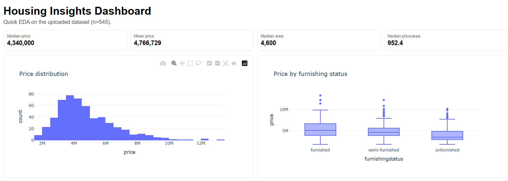

# 🏠 Housing Price Analysis & Dashboard

## 📌 Project Overview

This project focuses on analyzing housing data to identify the key factors affecting house prices. It also includes an interactive dashboard built using Power BI for better visualization and decision-making.

---

## 🎯 Objectives

* Understand factors influencing house prices
* Perform exploratory data analysis (EDA)
* Build insights for real estate trends
* Create a visual dashboard for business understanding

---

## 📊 Tools & Technologies

* Python (Pandas, NumPy, Matplotlib, Seaborn)
* Google Colab
* Power BI
* GitHub

---

## 📁 Dataset Description

The dataset contains the following features:

* Price
* Area
* Bedrooms
* Bathrooms
* Stories
* Main Road Access
* Guest Room
* Basement
* Air Conditioning
* Parking
* Preferred Area
* Furnishing Status

---

## 🔍 Key Insights

* Area is the strongest factor affecting house price
* Bathrooms have more impact than bedrooms
* Houses with air conditioning are significantly more expensive
* Properties on the main road have higher value
* Preferred areas show a noticeable price premium

---

## 📊 Exploratory Data Analysis

Key analyses performed:

* Price distribution analysis
* Correlation heatmap
* Area vs Price relationship
* Impact of amenities on pricing

---

## 📈 Dashboard (Power BI)

An interactive dashboard was created to visualize:

* Price distribution
* Feature-wise comparisons
* Key performance indicators (KPIs)

---

## 📷 Dashboard Preview

---

## 🤖 Model (Optional)

A basic Linear Regression model was used to predict housing prices based on:

* Area
* Bedrooms
* Bathrooms
* Stories
* Parking

---

## 🚀 Conclusion

The analysis shows that both structural features (area, bathrooms) and location-based factors (main road, preferred area) significantly influence housing prices.

---

## 📌 Future Improvements

* Use advanced models like Random Forest or XGBoost
* Add more real-world datasets
* Deploy as a web application

---

## 👩‍💻 Author

Radha

